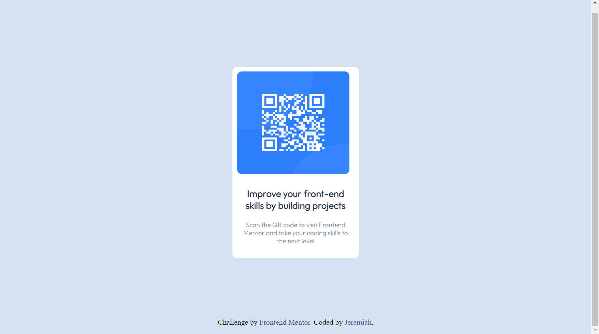

# Frontend Mentor - QR code component solution

This is a solution to the [QR code component challenge on Frontend Mentor](https://www.frontendmentor.io/challenges/qr-code-component-iux_sIO_H). Frontend Mentor challenges help you improve your coding skills by building realistic projects.

## Table of contents

- [Overview](#overview)
  - [Screenshot](#screenshot)
  - [Links](#links)
- [My process](#my-process)
  - [Built with](#built-with)
  - [What I learned](#what-i-learned)
  - [Continued development](#continued-development)
  - [Useful resources](#useful-resources)
- [Author](#author)

## Overview

### Screenshot



### Links

- Solution URL: [solution URL](https://github.com/H11TM4N/qr-code-component-main)
- Live Site URL: [live site URL](https://h11tm4n.github.io/qr-code-component-main/)

## My process

### Built with

- HTML5
- CSS

### What I learned

This was a simple and informative project. I actually finished the css section
of Anjela yu's web dev course, so this was a really good way to test my knowledge.
Something I learnt was how to center elements using the flex, justify-content, and
align-items. I initially used margin to center it, lol.

```html
<center>
  part of how i centered my code earlier. (i'm curious. Is it good practice?)
</center>
```

```css
the-new-thing-i-learnt {
  align-items: center;
  background-color: hsl(212, 45%, 89%);
  display: flex;
  justify-content: center;
  min-height: 100vh;
}
```

### Continued development

I'm looking forward to more projects so I can continue to improve

### Useful resources

Just google

## Author

- Github profile - [Jeremiah](https://github.com/H11TM4N)
- Frontend Mentor - [@H11TM4N](https://www.frontendmentor.io/profile/H11TM4N)
- Twitter - [@jeremiah_008](https://twitter.com/jeremiah_008)
